#Project 1:
<h1 color="red">DashBorad</h1>
In DashBoard Created the charts By using Some user data, With help of the Technology PHP,JAVASCRIPT,CSS,HTML,SQL

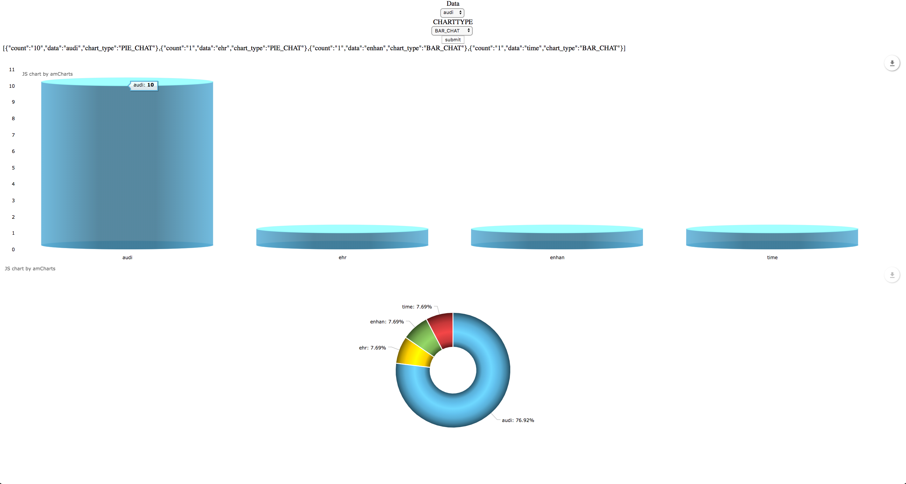

#Project:2
<h1 style="color:red">File Uploading</h1>
File Uploading by using PHP,SQL,HTML

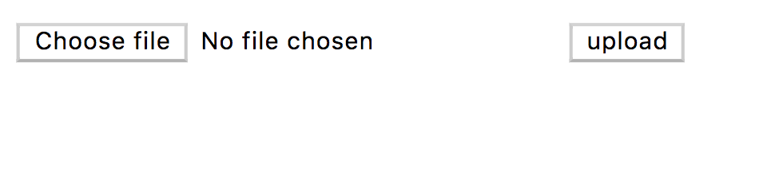

#Project:3
<h1 style="color:red">File Uploading By Using Angular Js</h1>
Used Angular js for instead of javascript and upload the file and show the uploaded file name in drop down, if you choose the filename it will show the file
Technology used
PHP,AngularJs,CSS,HTML,SQL

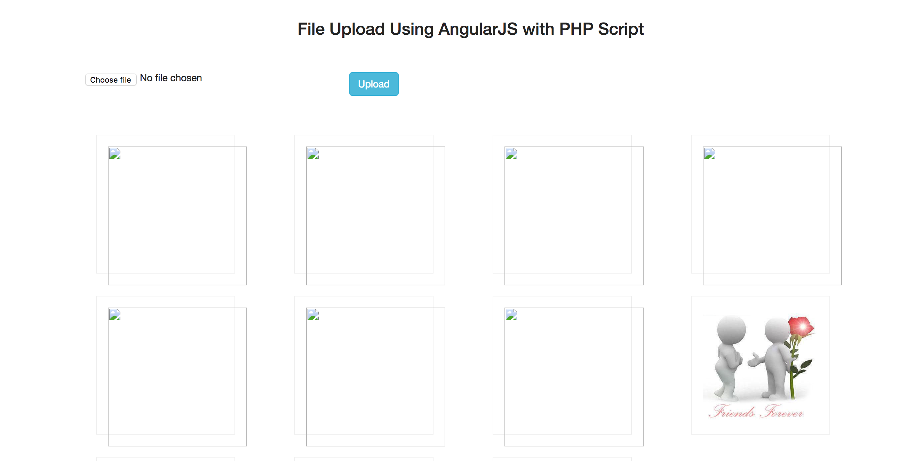

#Project:4
<h1>Oops concept</h1>
oops concepts in Php solved in program

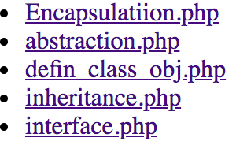

#Project:5
<h1 style="color:red">Project</h1>
Used to say about me created one template, created signup, login page if you are admin you can see the all contacts else you can edit or delete your account
technology used
HTML,CSS,Bootstrap,javascript,jqery,sql,php

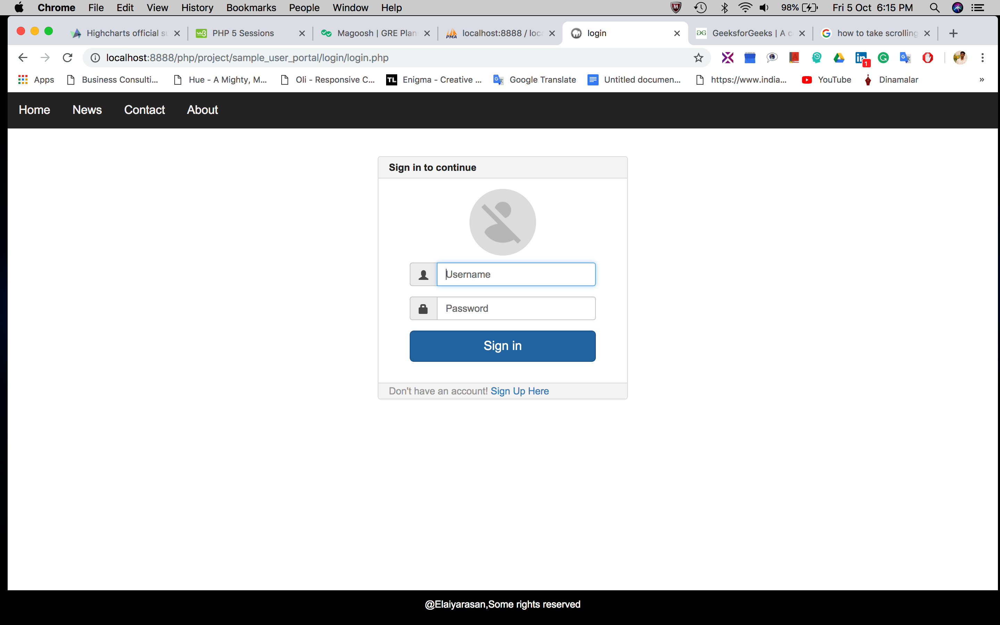
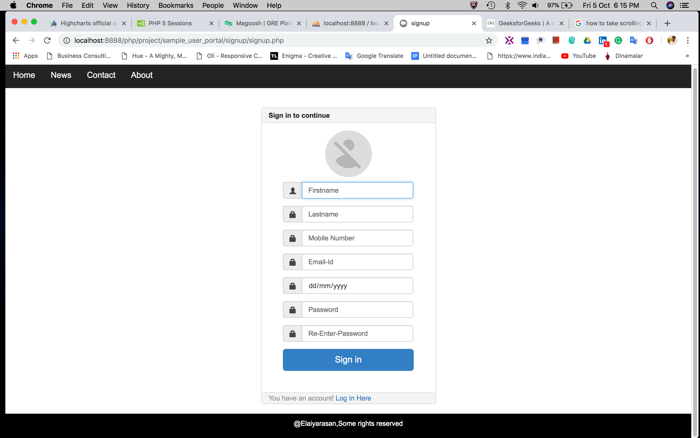
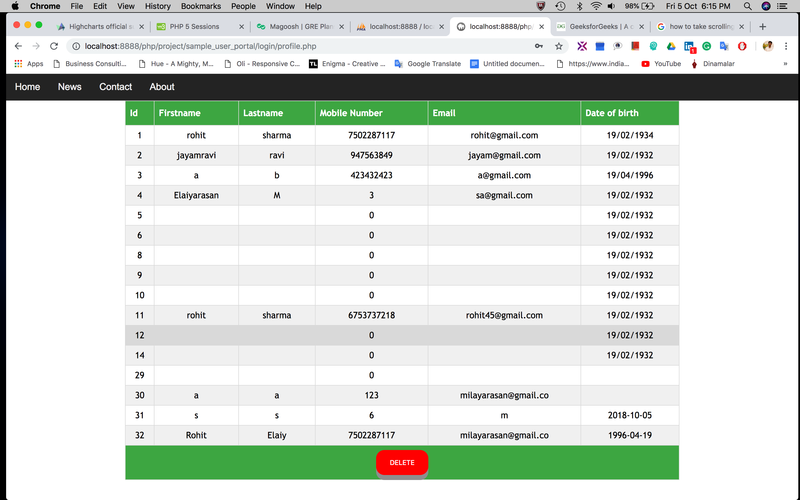
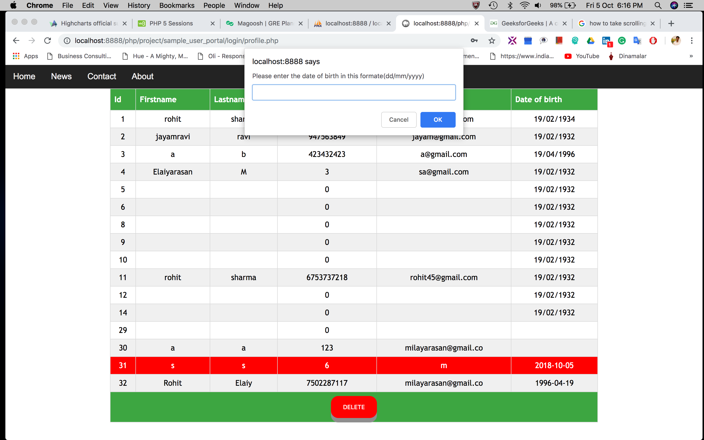
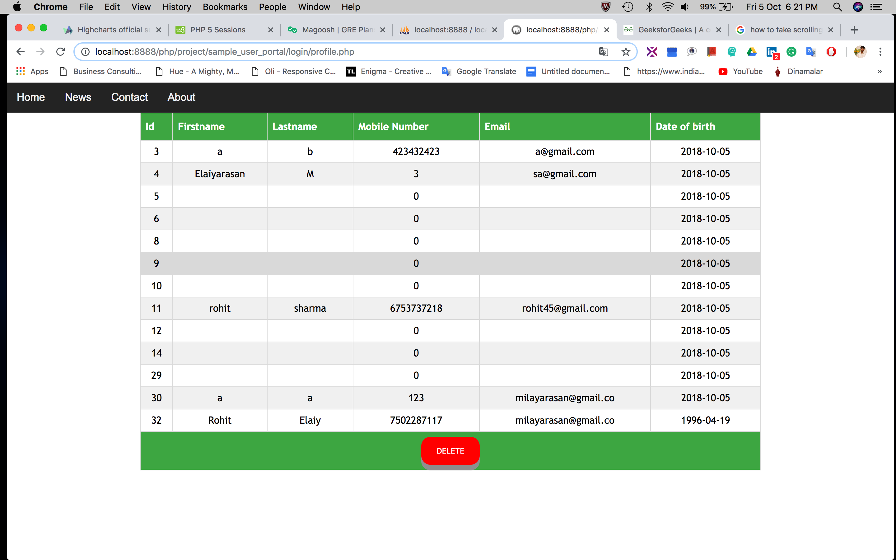
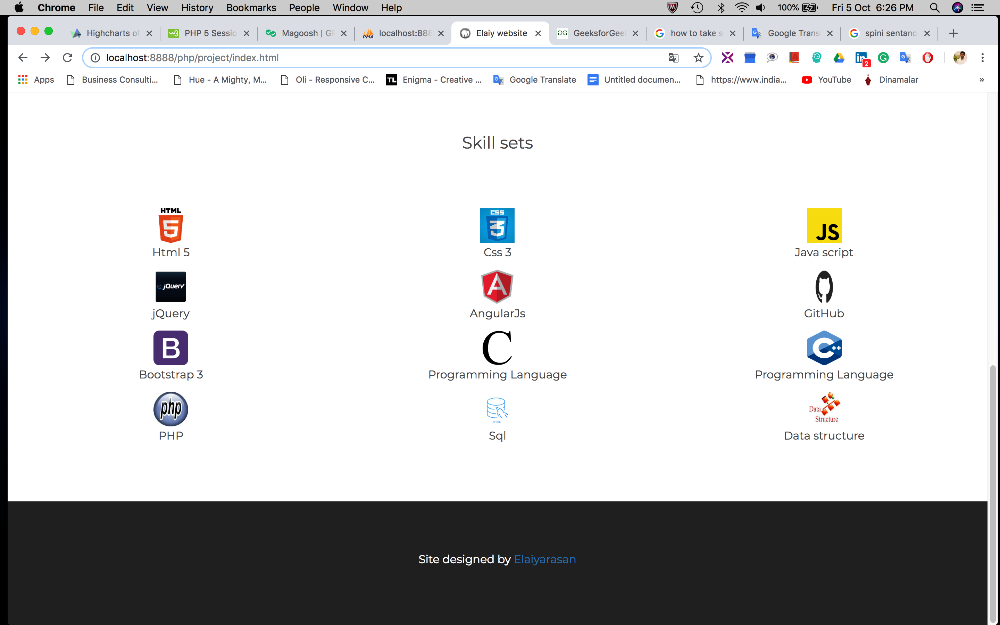

#Project:6
<h1 style="color:red">Push Notification</h1>
When user get login or signup the message will send to the user 
technology used
HTML,javascript,jqery,php

#Project:7
<h1 style="color:red">SMS</h1>
When user get login or signup the message will send to the user 
technology used
HTML,javascript,jqery,php,sql

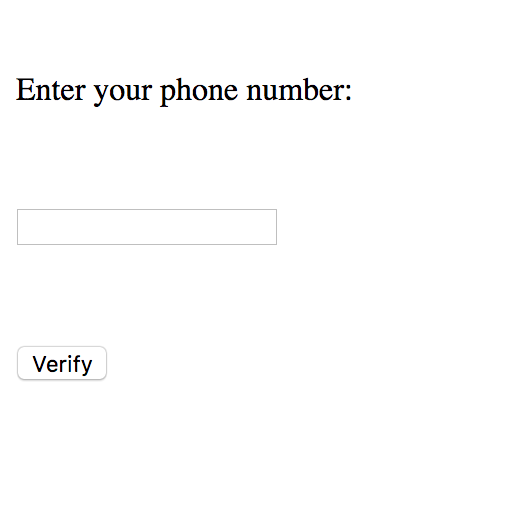

<h4 style="color:red">I attached all projects which needs the databases worked in sql as a file <i>'db.sql'</i>
